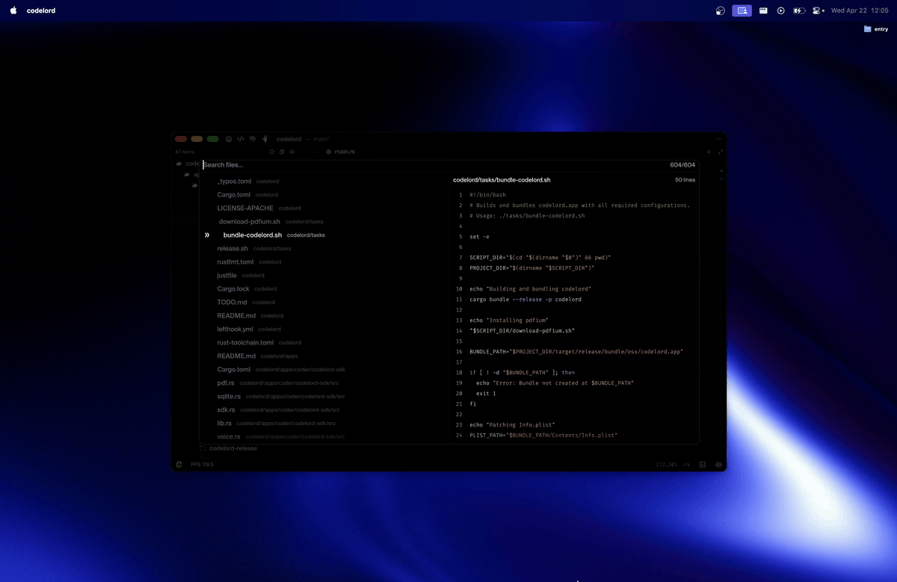
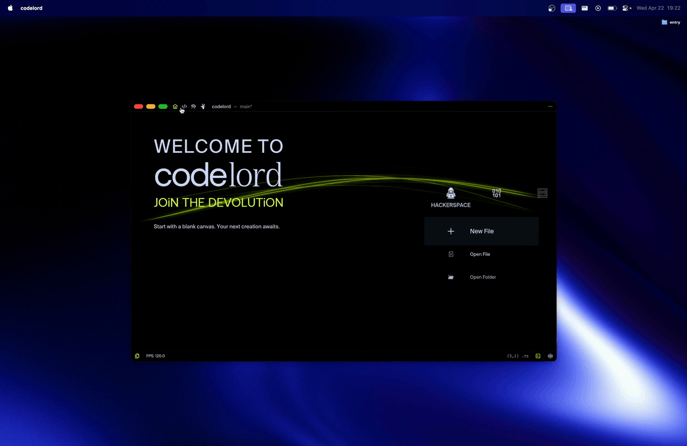
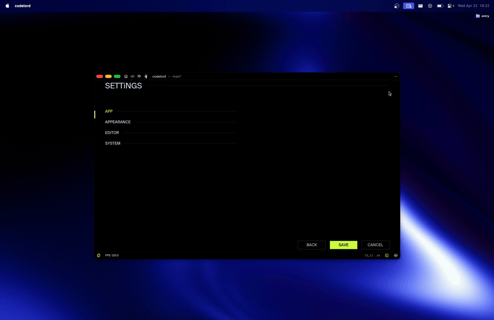

# codelord.

[](https://github.com/invisageable/codelord)
[](https://discord.gg/JaNc4Nk5xw)


---

> *codelord — Instantly code your thoughts.*

[home](https://github.com/invisageable/zo) — [install](./apps/coder/codelord-notes/public/guidelines/01-install.md) — [how-to](./apps/coder/codelord-how-to) — [license](#license)  


## about.

codelord iS A PROGRAMMABLE TEXT EDiTOR OS-LiKE FOR DEVS. RECLAiM THE DEVELOPER'S FLOW WiTH A HiGH-PERFORMANCE, GPU-NATiVE TEXT EDiTOR THAT RESPECTS YOUR MACHiNE, YOUR PRiVACY, AND YOUR THiNKiNG PROCESS.   

codelord iS FULL NATiVE TEXT EDiTOR WiTHOUT electron BLOAT AND WiTH A MiNiMAL MEMORY FOOTPRiNT. THE TELEMETRY iSN'T FOR US BUT FOR YOU. iT WiLL HELPS YOU TO BECOME MORE EFFiCiENT iN PROGRAMMiNG.

codelord ISN'T JUST ANOTHER vscode FORK OR CLONE — iT'S A REiMAGiNATiON. NATiVE GPU RENDERiNG, REPL-POWERED WORKFLOWS, REAL-TiME COLLABORATiON, AND A PLUGiN RUNTiME GiVE YOU SUPERPOWERS iN A CLEAN, MiNiMAL iNTERFACE. ALL WHiLE STAYiNG LiGHT, LOCAL-FiRST, AND PRiVACY-RESPECTiNG.

JOiN THE DEVOLUTiON.

## goals.

| features      | codelord    | zed         | cursor              | vscode        |
| :------------ | :---------- | :---------- | :------------------ | :------------ |
| FOUNDATION    | rust + egui | rust + gpui | vscodium + electron | electron      |
| SiZE          | 34 MB       | 321 MB      | 458 MB              | 664 MB        |
| UX/Ui         | GAME-LiKE   | STANDARD    | STANDARD            | STANDARD      |
| Ai            | Ai PARTNER  | Ai WRAPPER  | Ai WRAPPER          | Ai COMPLETiON |
| zo PLAYGROUND | ✔           | x           | x                   | x             |
| VOiCE CONTROL | ✔           | x           | x                   | x             |
| PRESENTER     | ✔           | x           | x                   | x             |
| EASTER EGGS   | ✔           | x           | x                   | x             |

## install.

  ```sh
  curl -fsSL                                         
  https://raw.githubusercontent.com/compilords/codelord/main/tasks/install.sh | sh
  ```

  NOTE: WE ARE LOOKiNG FOR LiNUX AND WiNDOWS WiZARDS TO HELP US PORT THE DEVOLUTiON TO EVERY PLATFORM. iF YOU WANT TO HELP, CHECK THE [CONTRiBUTiNG](#contributing) SECTiON.

## builtin features.

> *The most beautiful text editor you ever seen becomes real.*

**-filescope**



iNSPIRED BY ViM'S TELESCOPE, FiLESCOPE iT'S AN ELEGANT FiLE FINDER THAT'S LET YOU SEARCH ANY FiLES iN YOUR WORKSPACE.

**-magic-zoom**


ZOOM-iN AND ZOOM-OUT iN A JiT WAY — USE `CMD+E` TO ENABLE THE MAGIC ZOOM. VERY USEFUL FOR DEMOS, TALKS AND SO ON.

**-navigation**



A NOiCE WAY TO NAViGATE BETWEEN APPS QUiCKLY. codelord FEELS LESS LiKE A WiNDOW AND MORE LiKE A WORKSPACE DiRECTLY ON YOUR GPU.

**-file-tree-iconography**


A REFiNED ViSUAL HiERARCHY. iNSTANTLY iDENTiFY YOUR STACK WiTH A MiNiMALiST, HiGH-CONTRAST iCON SYSTEM DESiGNED FOR SPEED.

**-dark-in-the-light**



WHETHER YOU PREFER THE VOiD OR THE CLOUD, THE TRANSiTiON iS SEAMLESS.

**-voice-control**


JUST TALK TO codelord LiKE iS YOUR BUDDY — *"i WOULD LiKE TO DO SOME WORK, LET'S GO TO THE TEXT EDiTOR."*    
YOU CAN CONTROL THE WHOLE TEXT EDiTOR WiTH YOUR VOiCE.

## why codelord?

codelord WAS ORiGiNALLY BUiLT TO BE THE ULTiMATE HOME FOR THE [zo](https://github.com/invisageable/zo) PROGRAMMiNG LANGUAGE. i WAS BORED BY TRADiTiONAL REPLs AND BLOATED EDiTORs, SO WE BUiLT AN "OS-LiKE EDiTOR" WHERE THE PLAYGROUND AND THE TEXT ARE ONE.   

iF A NEW PROGRAMMiNG LANGUAGE APPEARS WiTHOUT iTS OWN ENViRONMENT, iT'S ALREADY BEHiND. zo DOESN'T JUST GiVE YOU SYNTAX; iT GiVES YOU THE MACHiNE. REMEMBER WHAT zo OFFERS YOU. ENJOY!

## contributing.

WE LOVE CONTRiBUTORS. THiS iS A PLAYGROUND FOR COMPiLER __NERDS__, FRONTEND __HACKERS__, AND __CREATIVE__.    
    
WE ESPECiALLY NEED HELP WiTH:

  - CROSS-PLATFORM — *bringind codelord to `linux` and `windows`.*
  - OS-LiKE SYSTEM — *expanding the limit of the `gpu` renderer.*
  - Ai iNTEGRATiON — *deepening the `ai` partner capabilities.*

FEEL FREE TO OPEN AN iSSUE iF YOU WANT TO CONTRiBUTE OR COME TO SAY HELLO ON [discord](https://discord.gg/JaNc4Nk5xw). ALSO YOU CAN CONTACT US AT `echo -n 'dGhlQGNvbXBpbG9yZHMuaG91c2U=' | base64 --decode`.   

## sponsors.

STARS, DONATiON AND SPONSORS ARE WELCOMiNG. SPREAD THE WORD e-ve-ry-where.    

## supports.

iF THiS PROJECT RESONATES WiTH YOU — PLEASE STAR iT. iT HELPS US GROW, ATTRACTS CONTRiBUTORS, AND VALiDATES THE DiRECTiON.    

## license.

[apache](./LICENSE-APACHE) — [mit](./LICENSE-MIT)

COPYRiGHT© **29** JULY **2024** — *PRESENT, [@invisageable](https://twitter.com/invisageable) — [@compilords](https://twitter.com/compilords) team.*
